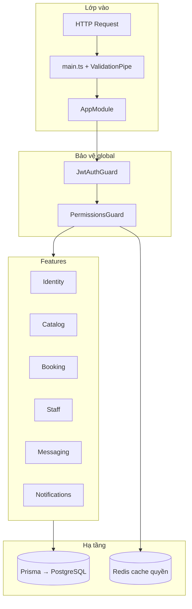
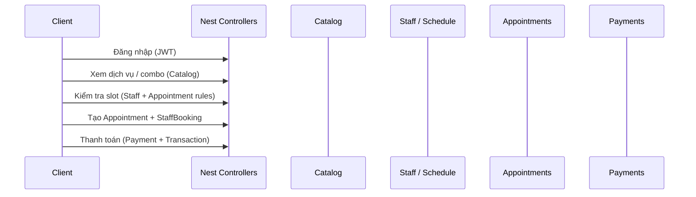

# Booking Business — Hướng dẫn làm quen dự án

Backend **NestJS** cho nền tảng đặt lịch (spa/salon/shop): quản lý shop, catalog dịch vụ, lịch hẹn, nhân sự, thanh toán, chat và thông báo. Dữ liệu lưu **PostgreSQL** qua **Prisma**; **Redis** dùng cache quyền người dùng.

---

## Bắt đầu từ đâu (thứ tự đọc code)

1. **`src/main.ts`** — Khởi động app, `ValidationPipe` toàn cục.
2. **`src/app.module.ts`** — Cây module: import feature nào, guard nào chạy global.
3. **`prisma/schema.prisma`** — “Bản đồ” domain: User, Shop, Appointment, Payment… Đọc schema trước khi đi sâu service giúp bạn không bị lạc quan hệ.
4. **`src/features/*`** — Theo từng nghiệp vụ; mỗi thư mục có **`README.md`** riêng (xem bên dưới).
5. **`src/common/`** — Decorator (`@Public()`, `@CurrentUser()`, `@RequirePermissions()`), pipe dùng chung.

**Gợi ý theo vai trò:**

| Mục tiêu | Đọc trước |
|----------|-----------|
| Đăng nhập / JWT / phân quyền | [Identity](src/features/identity/README.md), `jwt-auth.guard.ts`, `permissions.guard.ts` |
| Đặt lịch, thanh toán, review | [Booking](src/features/booking/README.md) |
| Dịch vụ, combo, nguyên liệu | [Catalog](src/features/catalog/README.md) |
| Ca làm, giờ mở cửa, nghỉ | [Staff](src/features/staff/README.md) |
| Chat | [Messaging](src/features/messaging/README.md) |

---

## Luồng tổng quan (request → domain)



**Luồng nghiệp vụ điển hình (đặt lịch):**



---

## Công nghệ

| Thành phần | Vai trò |
|------------|---------|
| NestJS 11 | Framework HTTP, module, DI |
| Prisma 7 | ORM, migration, schema |
| Passport (JWT + Local) | Login, bearer token |
| bcrypt | Hash mật khẩu |
| class-validator / class-transformer | DTO validation |
| ioredis | Cache permission codes |
| Socket.IO (trong dependency) | Có thể dùng cho realtime (kiểm tra gateway nếu có) |

---

## Chạy dự án

Cần file **`.env`** (xem `prisma`/Config): thường gồm `DATABASE_URL`, `JWT_SECRET`, Redis, `PORT`.

```bash
npm install
npx prisma generate
npx prisma migrate dev   # hoặc deploy tùy môi trường
npm run start:dev
```

Mặc định app lắng nghe cổng **`3000`** (hoặc `process.env.PORT`).

---

## Cấu trúc thư mục (rút gọn)

```
booking-business/
├── prisma/
│   ├── schema.prisma      # Model & quan hệ — đọc sớm
│   └── README.md          # Giải thích domain dữ liệu
├── src/
│   ├── main.ts
│   ├── app.module.ts
│   ├── common/            # Decorators, pipes, guards dùng chung
│   ├── prisma/            # PrismaModule global
│   ├── redis/             # RedisModule
│   └── features/          # README.md tổng quan + README từng nhóm
└── README.md              # File này
```

---

## Tài liệu chi tiết theo mục

| Thư mục | Nội dung |
|---------|----------|
| [src/README.md](src/README.md) | Cấu trúc `src`, luồng module |
| [src/features/README.md](src/features/README.md) | Bản đồ các feature |
| [prisma/README.md](prisma/README.md) | Khái niệm model & migration |
| [src/features/identity/README.md](src/features/identity/README.md) | Auth, user, role, permission |
| [src/features/catalog/README.md](src/features/catalog/README.md) | Category, service, combo, material |
| [src/features/booking/README.md](src/features/booking/README.md) | Appointment, payment, review |
| [src/features/staff/README.md](src/features/staff/README.md) | Lịch nhân viên, giờ làm, nghỉ |
| [src/features/messaging/README.md](src/features/messaging/README.md) | Conversation, message |
| [src/features/notifications/README.md](src/features/notifications/README.md) | Notification |
| [src/common/README.md](src/common/README.md) | Decorators & guards dùng chung |

Các README trong **`src/features/*/`** có thêm **sơ đồ Mermaid** (sequence/flowchart), **bước xử lý trong service** và **bảng permission/route** bám sát code hiện tại.

---

## Ghi chú bảo mật

- Hầu hết route yêu cầu **JWT** (`JwtAuthGuard` global). Route công khai gắn **`@Public()`** (ví dụ `POST /auth/login`, `POST /auth/register`).
- Phân quyền chi tiết dùng **`@RequirePermissions({ codes: [...] })`**; `PermissionsGuard` gộp quyền từ mọi role của user và cache **5 phút** trên Redis.
