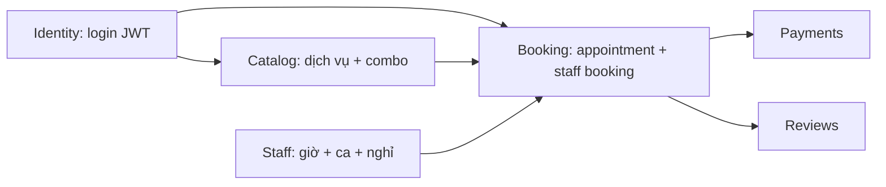

# `src/features/` — Các nhóm nghiệp vụ

Mỗi **feature** là một vùng domain: `*.module.ts`, controller, service, `dto/`.

## Bản đồ module (`app.module.ts`)

| Module Nest | File gom | Nội dung |
|-------------|-----------|----------|
| **IdentityModule** | `identity.module.ts` | Auth, Users, Roles, Permissions |
| **CatalogModule** | `catalog.module.ts` | Categories, Services, Combos |
| **BookingModule** | `booking.module.ts` | Appointments, Payments, Reviews |
| **MessagingModule** | `messaging.module.ts` | Conversations, Messages |
| **StaffModule** | `staff.module.ts` | StaffSchedule, StaffDayOff, WorkingHour |
| **NotificationsModule** | `notifications/notifications/...` | Notifications |

`ConfigModule`, `PrismaModule`, `RedisModule` nạp ở `AppModule`.

---

## Luồng nghiệp vụ xuyên feature (rút gọn)

---

## README chi tiết (có sơ đồ & luồng API)

| Feature | File |
|---------|------|
| Identity | [identity/README.md](identity/README.md) — đăng ký/đăng nhập, JWT, PermissionsGuard |
| Catalog | [catalog/README.md](catalog/README.md) — setup shop, liên kết appointment |
| Booking | [booking/README.md](booking/README.md) — **transaction tạo lịch**, combo expand, payment, review |
| Staff | [staff/README.md](staff/README.md) — working hour, schedule, day off, liên kết StaffBooking |
| Messaging | [messaging/README.md](messaging/README.md) — conversation + nested messages |
| Notifications | [notifications/README.md](notifications/README.md) — route `me` vs quyền admin |

Mã permission đầy đủ: `src/common/constants/permissions.ts`.
