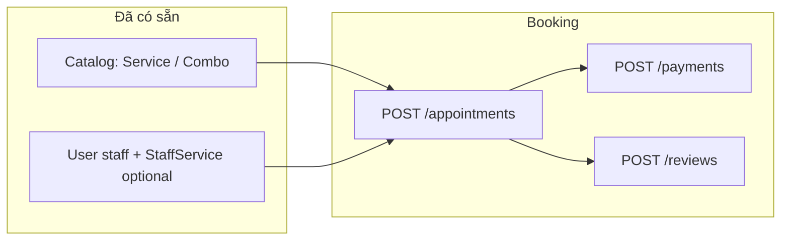
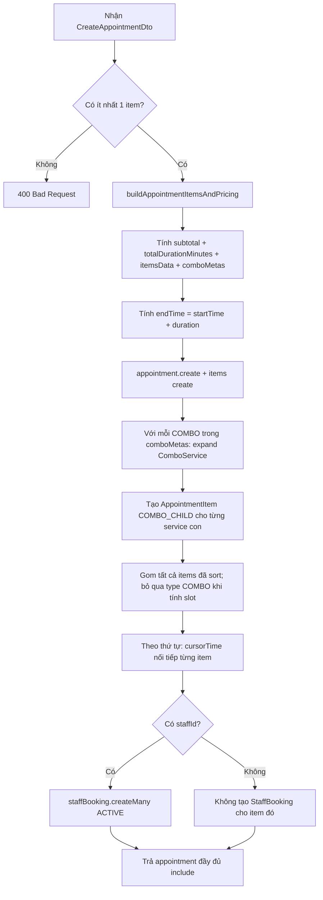
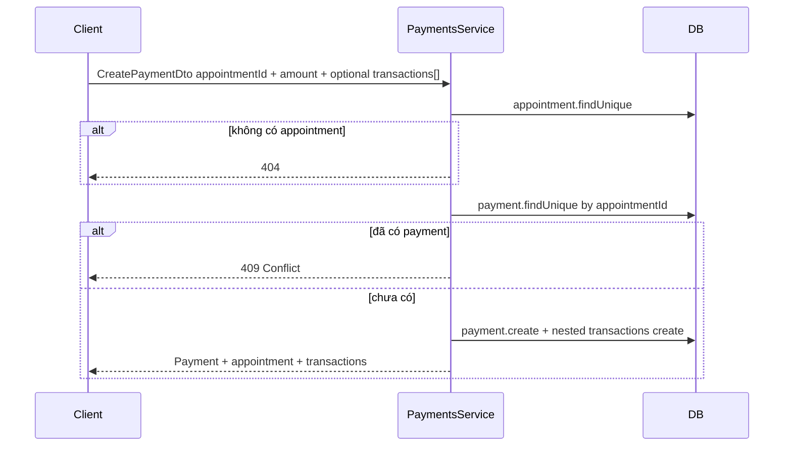

# Feature: Booking — Lịch hẹn, thanh toán, đánh giá

## Vai trò

- **Appointments:** Tạo lịch, items (dịch vụ / combo / custom), tính tổng tiền & thời lượng, sinh **StaffBooking** theo từng item có `staffId`.
- **Payments:** Một **Payment** cho mỗi appointment; nhiều **PaymentTransaction** (charge / refund).
- **Reviews:** Một **Review** cho mỗi appointment (sau khi hoàn thành dịch vụ — theo nghiệp vụ UI).

---

## Luồng end-to-end — Từ catalog đến thanh toán

---

## Luồng chi tiết — `POST /appointments` (`appointments.service.create`)

Chạy trong **`prisma.$transaction`** (all-or-nothing).

**Các bước quan trọng:**

1. **`buildAppointmentItemsAndPricing`** — Với từng phần tử trong `dto.items`:
   - **SERVICE:** `findFirst` service theo `serviceId` + **`shopId`**; snapshot giá, duration, buffer; cộng subtotal.
   - **COMBO:** load combo + `services`; thời lượng = tổng duration từng dòng combo hoặc `estimatedDurationMinutes`; lưu **comboMetas** (sortOrder, comboId, staffId gán cho child).
   - **CUSTOM:** dòng tự mô tả, giá/duration 0 trong code hiện tại (mở rộng sau).
2. **Tạo appointment** với `items.create: itemsData` (cha COMBO/SERVICE/CUSTOM trước).
3. **Expand combo:** Với mỗi meta, tìm parent item **COMBO** vừa tạo, đọc `comboService`, tạo lần lượt **COMBO_CHILD** (mỗi quantity × lần lặp), gán `staffId` từ meta nếu có.
4. **StaffBooking:** Duyệt items đã sort theo `sortOrder`; **bỏ qua** `type === COMBO` (chỉ book theo dòng thực thi). Với mỗi item còn lại, nếu có `staffId`, push một khoảng `[cursorTime, cursorTime + duration)`; `createMany` **StaffBooking** `ACTIVE`.

**Query list:** `GET /appointments` — `shopId`, `status`, `customerId`, `from`, `to`, `skip`, `take`.

**Cập nhật / xóa:** `PATCH/DELETE /appointments/:id` — permission `UPDATE_APPOINTMENT` / `DELETE_APPOINTMENT`. Lưu ý: `update` chủ yếu sửa metadata appointment (thời gian, status, discount, note); không refactor lại toàn bộ expand combo trong file hiện tại.

---

## Luồng chi tiết — `POST /payments` (`payments.service.create`)

- **Ràng buộc:** Một appointment **chỉ một** bản ghi `Payment` (`appointmentId` unique).
- **Transactions:** Optional ngay lúc tạo; phù hợp ghi nhận lần charge đầu + metadata provider.

---

## Luồng chi tiết — `POST /reviews` (`reviews.service.create`)

1. `appointment.findUnique` — không có → 404.
2. `review.findUnique` theo `appointmentId` — đã có → **409** (một lịch một review).
3. `rating` phải trong **1..5**.
4. `userId` trên review = `appointment.customerId` (khách của lịch đó).

---

## Bảng API & permission

| Module | Base | Đặc điểm |
|--------|------|-----------|
| Appointments | `/appointments` | `CREATE_APPOINTMENT`, `VIEW_*`, `UPDATE_*`, `DELETE_*` |
| Payments | `/payments` | `CREATE_PAYMENT`, … |
| Reviews | `/reviews` | `CREATE_REVIEW`, … |

---

## Dữ liệu đọc kèm (chi tiết lịch)

`findOne` appointment include: `items` (service/combo/staff/parent-child), `customer`, `shop`, **`payment.transactions`**, **`review`**.

---

## File nên đọc

1. `appointments/appointments.service.ts` — toàn bộ luồng transaction + combo + staff booking.
2. `appointments/dto/create-appointment.dto.ts` — cấu trúc `items[]`.
3. `payments/payments.service.ts`, `reviews/reviews.service.ts`.
4. `prisma/schema.prisma` — `Appointment`, `AppointmentItem`, `StaffBooking`, `Payment`, `PaymentTransaction`, `Review`.
