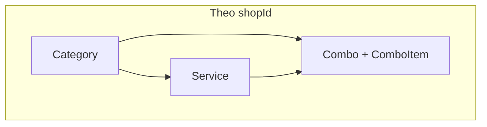
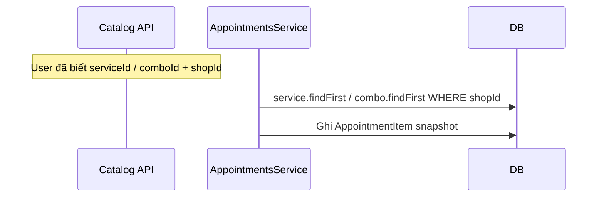

# Feature: Catalog — Danh mục dịch vụ

## Vai trò

Chuẩn bị dữ liệu bán hàng cho **Shop**: nhóm (**Category**), **Service** (thời lượng, giá), **Combo** (gói nhiều service).  
**Appointment** khi tạo sẽ **snapshot** giá/tên/thời lượng từ catalog tại thời điểm đặt — thay đổi catalog sau đó không làm sai lịch cũ.

---

## Luồng tổng — Thiết lập shop (góc nhìn nghiệp vụ)

1. Tạo **Category** (phân nhóm UI).
2. Tạo **Service** (`shopId`, optional `categoryId`).
3. (Tùy) Gán staff làm được service qua bảng `StaffService`.
4. Tạo **Combo** + các dòng **ComboItem** (service + quantity + order).

---

## Luồng API — CRUD chuẩn

Mỗi resource dùng pattern giống nhau:

| Bước | Hành động | Permission ví dụ |
|------|-----------|------------------|
| 1 | `POST /<resource>` | `CREATE_*` |
| 2 | `GET /<resource>?...` | `VIEW_*` |
| 3 | `GET /<resource>/:id` | `VIEW_*` |
| 4 | `PATCH /<resource>/:id` | `UPDATE_*` |
| 5 | `DELETE /<resource>/:id` | `DELETE_*` |

**Prefix controller thực tế:**

| Resource | Base path | Query list (ví dụ) |
|----------|-----------|---------------------|
| Category | `/categories` | (xem controller) |
| Service | `/services` | `status`, `categoryId` |
| Combo | `/combos` | (xem controller) |

Tất cả đều có `@RequirePermissions` tương ứng (`CREATE_SERVICE`, `VIEW_CATEGORY`, …).

---

## Luồng chi tiết — Tạo Service (`services.service.ts`)

1. Client gửi `CreateServiceDto` (có `shopId`, `name`, `duration`, `price`, …).
2. `service.create` với `categoryId` optional.
3. Trả về include `category`, `staffs`.

**Đọc list:** `findAll` lọc theo `status`, `categoryId` — **không** bắt buộc truyền `shopId` trong đoạn code hiện tại; khi triển khai production thường cần ràng buộc theo shop (middleware hoặc bắt buộc query).

---

## Luồng chi tiết — Combo

1. **Combo** có `price` riêng (giá gói), `estimatedDurationMinutes` fallback.
2. Bảng **ComboService** nối `comboId` + `serviceId` + `quantity` + `order`.
3. Khi tạo **Appointment** với item type `COMBO`, `appointments.service` sẽ:
   - Tạo item cha type **COMBO** (snapshot giá/tên/thời lượng gói).
   - Sau đó **expand** từng service trong combo thành item con **COMBO_CHILD** (xem README Booking).

---

## Luồng liên kết sang Booking

`buildAppointmentItemsAndPricing` trong `appointments.service.ts` đọc **Service** / **Combo** theo `shopId` để tính `subtotal`, `totalDurationMinutes` và snapshot từng dòng item.

---

## Bảng mã permission (catalog)

| Nhóm | Mã |
|------|-----|
| Category | `CREATE_CATEGORY`, `VIEW_CATEGORY`, `UPDATE_CATEGORY`, `DELETE_CATEGORY` |
| Service | `CREATE_SERVICE`, … |
| Combo | `CREATE_COMBO`, … |

---

## File nên đọc

1. `dto/create-*.dto.ts` — field bắt buộc / optional.
2. `services/services.service.ts`, `combos/combos.service.ts` — logic tạo + include quan hệ.
3. `../catalog.module.ts` — gom 3 module.
