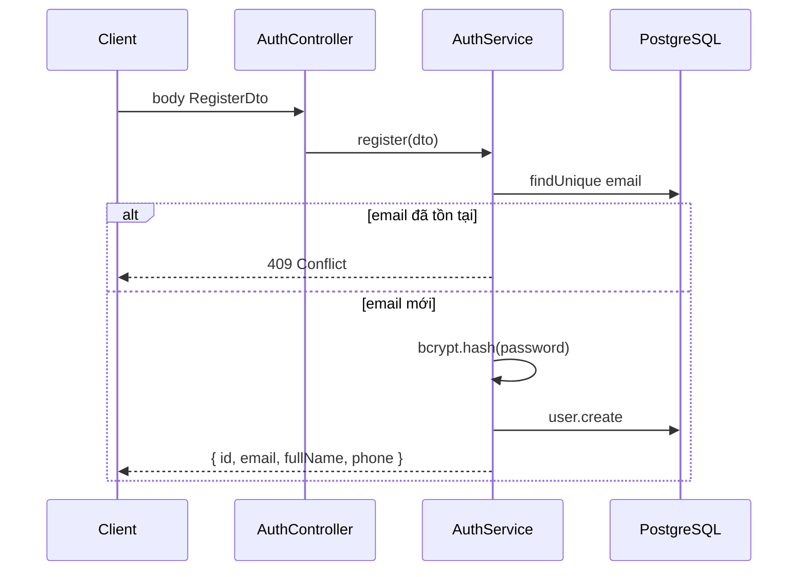
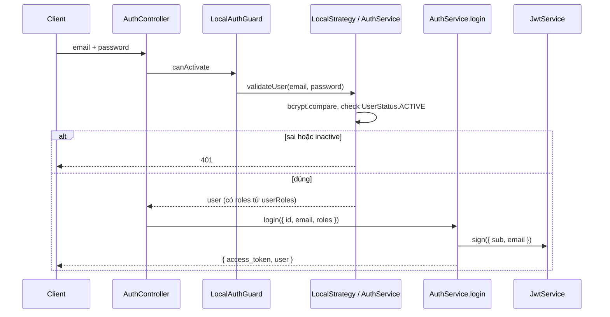
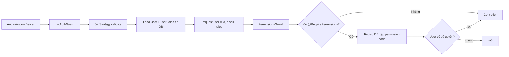

# Feature: Identity — Xác thực & RBAC

## Vai trò

Đăng ký/đăng nhập (**JWT**), quản lý **User**, **Role**, **Permission**. Mọi route khác (trừ `@Public()`) đều cần token hợp lệ; nhiều route còn cần **mã permission** cụ thể (xem `src/common/constants/permissions.ts`).

---

## Luồng 1 — Đăng ký (`POST /auth/register`)

Route **public** (`@Public()`), không qua permission.

**Lưu ý:** Đăng ký **không** trả JWT; client cần gọi `POST /auth/login` sau để lấy `access_token`.

---

## Luồng 2 — Đăng nhập (`POST /auth/login`)

**Payload JWT:** `{ sub: userId, email }` — **không** chứa danh sách permission; permission được tính lúc gọi API (guard).

---

## Luồng 3 — Request có JWT (hầu hết API)

- **`JwtStrategy.validate`:** Mỗi request có JWT đều load lại user từ DB (đảm bảo vẫn ACTIVE).
- **`PermissionsGuard`:** Cache tập mã permission (JSON) trong Redis ~5 phút; key dạng `user:permissions:<userId>`. Nếu Redis lỗi thì đọc trực tiếp quan hệ `User` → `UserRole` → `Role` → `RolePermission` → `Permission`.

---

## Cấu trúc module

| Module | Base path | Vai trò |
|--------|-----------|---------|
| **Auth** | `POST /auth/login`, `POST /auth/register` | Public; JWT + Local |
| **Users** | `/users` | CRUD user + query `status`, `shopId` (list) |
| **Roles** | `/roles` | CRUD role (gắn `shopId` nếu role theo shop) |
| **Permissions** | `/permissions` | CRUD permission toàn cục |

Mọi route **users / roles / permissions** đều có `@RequirePermissions(...)` tương ứng (`CREATE_USER`, `VIEW_USER`, …).

---

## Bảng quyền (mã dùng trong code)

Nhóm Identity trong `Permissions`:

| Hành động | Mã |
|-----------|-----|
| User | `CREATE_USER`, `VIEW_USER`, `UPDATE_USER`, `DELETE_USER` |
| Role | `CREATE_ROLE`, `VIEW_ROLE`, … |
| Permission | `CREATE_PERMISSION`, `VIEW_PERMISSION`, … |

User phải được gán **role** (qua `UserRole` + shop) mà role đó có **RolePermission** chứa các mã trên thì mới gọi được API tương ứng.

---

## File đọc theo thứ tự

1. `auth/auth.controller.ts` — entry public.
2. `auth/auth.service.ts` — `validateUser`, `login`, `register`.
3. `auth/strategies/jwt.strategy.ts` — `JWT_SECRET`, validate payload.
4. `auth/guards/jwt-auth.guard.ts` + `common/decorators/public.decorator.ts`.
5. `auth/guards/permissions.guard.ts` — cache + check permission.
6. `users/users.controller.ts` — ví dụ route cần permission.

---

## Liên kết nghiệp vụ

- **Booking / Catalog / …** không tự xác thực riêng: dựa vào guard global + `@RequirePermissions` trên từng controller.
- Seed dữ liệu **Permission** + gán vào **Role** + **UserRole** là điều kiện tiên quyết để client gọi được API sau đăng nhập.
