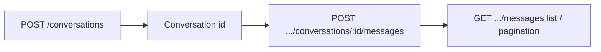
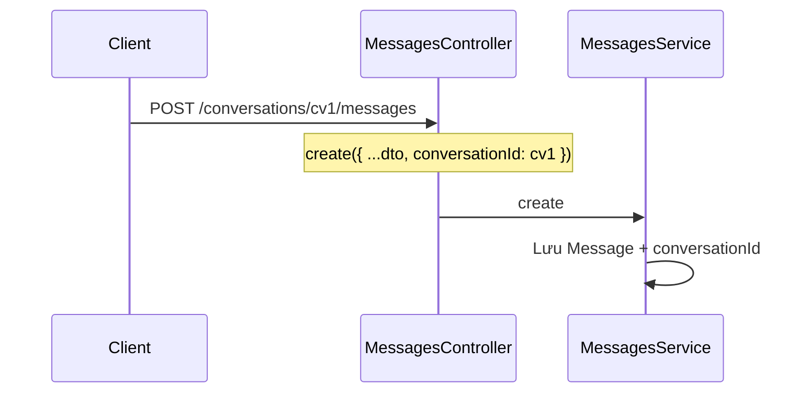

# Feature: Messaging — Hội thoại & tin nhắn

## Vai trò

- **Conversation:** Cuộc hội thoại giữa **customer** và (optional) **staff**, trạng thái `OPEN` / `RESOLVED` / `CLOSED`, có thể gắn **một** `appointmentId` (unique khi set).
- **Message:** Tin nhắn trong conversation; `senderType` (CUSTOMER / STAFF / SYSTEM), `messageType` (TEXT / IMAGE / SYSTEM).

---

## Luồng tổng — Từ hội thoại đến tin nhắn

1. Tạo **Conversation** (`customerId`, optional `staffId`, optional `appointmentId`).
2. Client (hoặc staff) gửi **Message** qua route **lồng** dưới `conversationId`.
3. Đọc danh sách conversation (`GET /conversations`) hoặc tin theo hội thoại (`GET .../messages`).

---

## Luồng API — Conversations (`/conversations`)

| Method | Path | Permission | Ghi chú |
|--------|------|------------|---------|
| POST | `/conversations` | `CREATE_CONVERSATION` | Tạo hội thoại |
| GET | `/conversations` | `VIEW_CONVERSATION` | Query: `status`, `customerId`, `staffId`, `skip`, `take` |
| GET | `/conversations/:id` | `VIEW_CONVERSATION` | Chi tiết |
| PATCH | `/conversations/:id` | `UPDATE_CONVERSATION` | Gán staff, đổi status, `assignedAt`, … |
| DELETE | `/conversations/:id` | `DELETE_CONVERSATION` | Xóa |

**Field `assignedAt`:** Ghi nhận khi staff tiếp nhận — phục vụ đo SLA (thời gian chờ phản hồi đầu tiên).

---

## Luồng API — Messages (nested)

Controller: **`/conversations/:conversationId/messages`** (`messages.controller.ts`).

| Method | Path | Permission |
|--------|------|------------|
| POST | `.../messages` | `CREATE_MESSAGE` — body không cần `conversationId` (gắn từ URL) |
| GET | `.../messages` | `VIEW_MESSAGE` — phân trang `skip`/`take` |
| GET | `.../messages/:id` | `VIEW_MESSAGE` |
| PATCH | `.../messages/:id` | `UPDATE_MESSAGE` |
| DELETE | `.../messages/:id` | `DELETE_MESSAGE` |

---

## Luồng tích hợp (schema)

- **Telegram:** `Message.telegramMsgId`, model `TelegramAccount` gắn `staffId` — có thể đồng bộ tin với Telegram (logic chi tiết trong service nếu có).

---

## File nên đọc

1. `conversations/conversations.controller.ts` + `conversations.service.ts`
2. `messages/messages.controller.ts` + `messages.service.ts`
3. `dto/create-conversation.dto.ts`, `dto/create-message.dto.ts`
