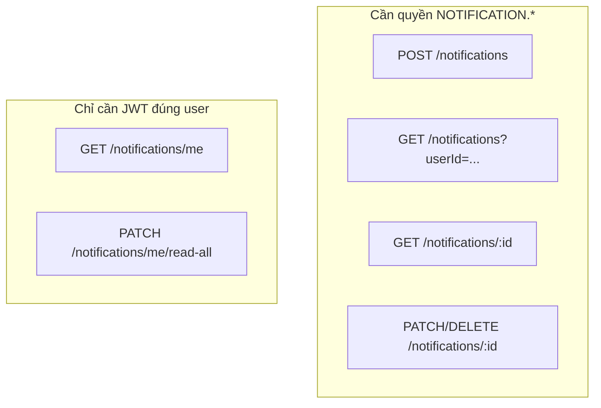
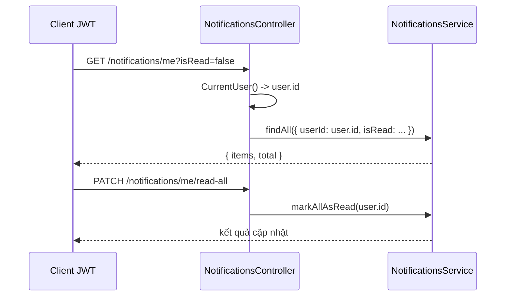

# Feature: Notifications — Thông báo

## Vai trò

Lưu thông báo trong app cho **User** (`NotificationType`: APPOINTMENT, PAYMENT, SYSTEM), có cờ `isRead`.

---

## Hai kiểu sử dụng — Admin / hệ thống vs chính user

| Route | Ai dùng | Permission |
|-------|---------|------------|
| `POST /notifications` | Backend / admin tạo thông báo cho user | `CREATE_NOTIFICATION` |
| `GET /notifications` | Xem theo filter (vd `userId`, `isRead`, `type`) | `VIEW_NOTIFICATION` |
| `GET /notifications/me` | User xem **thông báo của chính mình** | **Không** có `@RequirePermissions` — chỉ cần đăng nhập |
| `PATCH /notifications/me/read-all` | Đánh dấu đã đọc hết của **current user** | **Không** có `@RequirePermissions` |
| `GET/PATCH/DELETE /notifications/:id` | Thao tác theo id | `VIEW/UPDATE/DELETE_NOTIFICATION` |

**Lưu ý:** Hai route `me` dùng `@CurrentUser()` để lấy `user.id` — client không cần truyền `userId` trên URL, tránh lộ/sửa nhầm user khác.

---

## Luồng chi tiết — User đọc thông báo

---

## Luồng chi tiết — Tạo thông báo (hệ thống)

1. Service/scheduler gọi `POST /notifications` với body `userId`, `type`, `title`, `content` (cần quyền `CREATE_NOTIFICATION`).
2. Hoặc gọi trực tiếp `NotificationsService.create` từ module khác nếu được inject (hiện tại có thể chưa wire — kiểm tra `NotificationsModule` exports).

---

## Query list (`GET /notifications`)

Hỗ trợ `userId`, `isRead` (`true`/`false` string), `type`, `skip`, `take`.

---

## File nên đọc

1. `notifications/notifications.controller.ts` — phân biệt route `me` và route có permission.
2. `notifications/notifications.service.ts`
3. `dto/create-notification.dto.ts`
