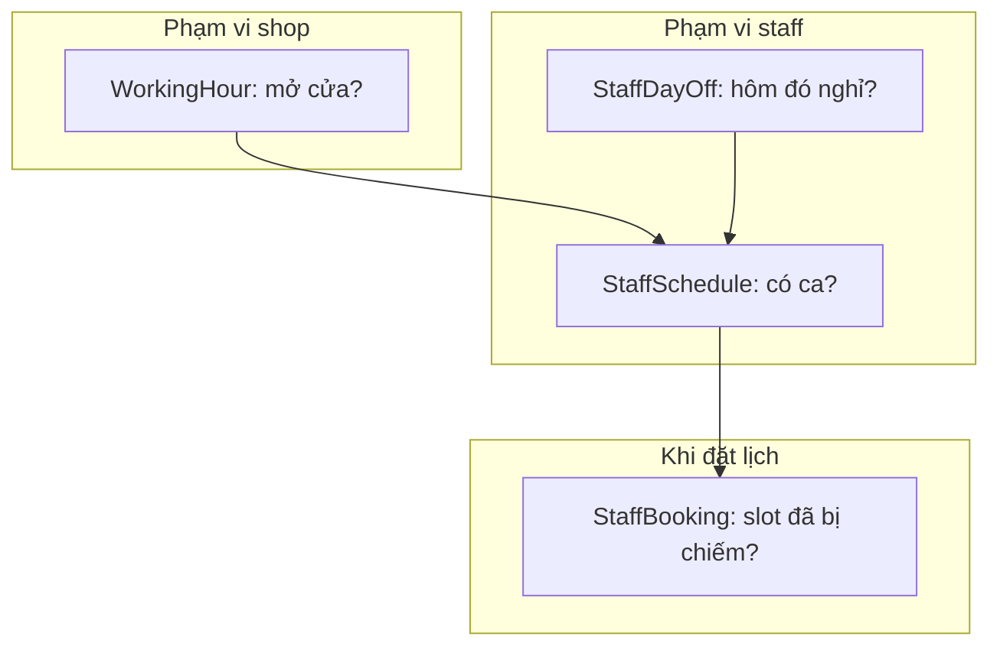
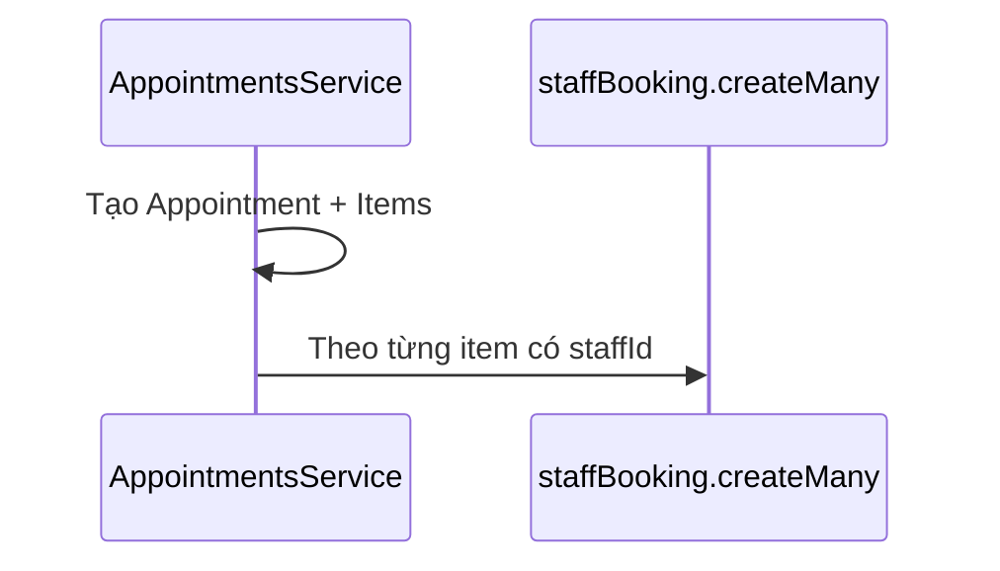

# Feature: Staff — Lịch làm việc & giờ mở cửa

## Vai trò

Ba lớp thời gian bổ sung cho nhau:

| Lớp | Model | Ý nghĩa |
|-----|--------|---------|
| **Shop** | `WorkingHour` | Giờ mở/đóng cửa theo **ngày trong tuần** (`DayOfWeek`), có `isClosed`. |
| **Nhân viên** | `StaffSchedule` | Ca làm **lặp theo tuần** (cùng `dayOfWeek`), thuộc `shopId` + `staffId`. |
| **Ngoại lệ** | `StaffDayOff` | Nghỉ **một ngày cụ thể** (`@db.Date`), ghi đè lịch lặp. |

**Shop.timezone** (IANA, ví dụ `Asia/Ho_Chi_Minh`) dùng để hiển thị và cộng trừ giờ đúng múi — các field `Time` trong DB không mang timezone.

---

## Luồng nghiệp vụ — Ai rảnh lúc nào (khái niệm)

**Trong code hiện tại:** Module Staff chủ yếu **CRUD** ba bảng trên. Logic “tìm slot trống” tổng hợp WorkingHour + StaffSchedule + StaffDayOff + **StaffBooking** có thể nằm ở tầng appointment hoặc service riêng — nếu chưa thấy endpoint “suggest slot”, đó là phần có thể mở rộng sau.

**Ràng buộc DB (schema):** Comment trong `schema.prisma` gợi ý thêm **EXCLUDE constraint** trên `StaffBooking` (cùng staff, khoảng thời gian chồng, `status = ACTIVE`) — cần SQL migration thủ công sau `prisma migrate`.

---

## Luồng API — Pattern giống nhau

Mỗi resource: `POST` → `GET` (list + query) → `GET :id` → `PATCH` → `DELETE`.

| Module | Base path | Permission prefix |
|--------|-----------|-------------------|
| WorkingHour | `/working-hours` | `CREATE_WORKING_HOUR`, `VIEW_*`, … |
| StaffSchedule | `/staff-schedules` | `CREATE_STAFF_SCHEDULE`, … |
| StaffDayOff | `/staff-days-off` | `CREATE_STAFF_DAY_OFF`, … |

Chi tiết query (`shopId`, `staffId`, …) xem từng `*.controller.ts`.

---

## Luồng chi tiết — Tạo StaffDayOff (ví dụ)

1. Client gửi `staffId`, `shopId`, `date`, optional `reason`.
2. Service kiểm tra tồn tại user/shop (tùy implementation).
3. `staffDayOff.create` — dùng để **chặn** đặt lịch vào ngày đó cho staff đó (khi tầng booking kiểm tra).

---

## Liên kết với Catalog & Booking

- **StaffService** (bảng trong Prisma): gắn staff ↔ service — ai được phép làm dịch vụ nào (thường quản lý khi setup nhân sự + catalog).
- **StaffBooking:** Sinh từ `appointments.service` khi tạo lịch có `staffId` trên từng item (SERVICE / COMBO_CHILD / CUSTOM), trừ dòng chỉ là **COMBO** parent.

---

## File nên đọc

1. `working-hour/working-hour.controller.ts` + `*.service.ts`
2. `staff-schedule/*`, `staff-day-off/*`
3. `prisma/schema.prisma` — `WorkingHour`, `StaffSchedule`, `StaffDayOff`, `StaffBooking`
